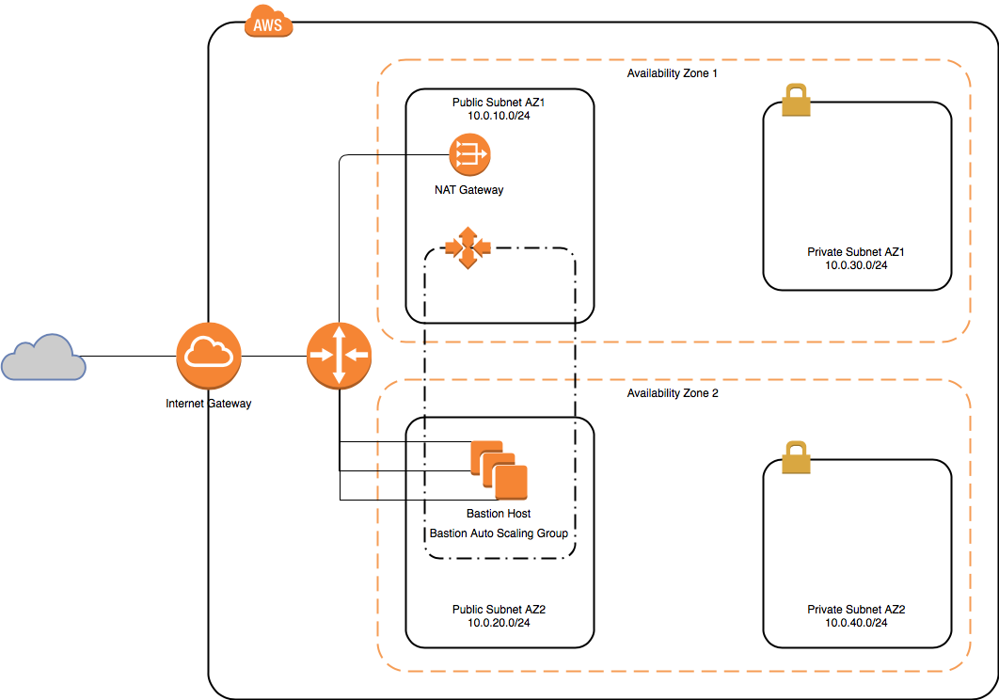

# AWS CloudFormation VPC [](https://saythanks.io/to/GerardRibas)

A CloudFormation Template that demonstrates how to create a Virtual Private Network VPC with a few steps!

The main design of this VPC has been created following these considerations:

- Public And Private Subnets
- High Availability
- NAT Gateway for private instances
- SSH Bastion Auto Scaling Group for Management

## Diagram

<p align="center">
  
</p>

## Parameters

You can customize some of the configuration of the VPC with these parameters:

Parameter            | Description                                                    | Default Value
-------------------- | -------------------------------------------------------------- | -------------
BastionInstanceType  | Bastion Host EC2 instance typel                                | t2.nano 
KeyName              | CName of an existing EC2 KeyPair to enable SSH in Bastion Host | us-key-pair
SshCidrIpAllowed     | IP CIDR Block to allow SSH in Bastion Host                     | 0.0.0.0/0 

## Mappings

For now, the CloudFormation stack is only ready to be deployed in `us-east-1` as mappings only contains the AMI ID for this region. But if you want to deploy it to another region Pull Requests are welcome! :)

#### CIDR Blocks

```
public:
      az1: "10.0.10.0/24"
      az2: "10.0.20.0/24"
private:
      az1: "10.0.30.0/24"
      az2: "10.0.40.0/24"
```

#### Region Map

```
us-east-1:
    HVM64: ami-035be7bafff33b6b6
```

## Configuration in Detail

The VPC is configured following the standards that are described in AWS documentation for [Scenario 2](https://docs.aws.amazon.com/vpc/latest/userguide/VPC_Scenario2.html), with the addition of the High Availabilty and the Bastion Auto Scaling group. Let's dive in!

- A VPC with a size /16 IPv4 CIDR block (10.0.0.0/16). This provides 65,536 private IPv4 addresses.
 
- Two public subnets with a size /24 IPv4 CIDR block (10.0.10.0/24 and 10.0.20.0/24). This provides 256 private IPv4 addresses in each subnet. Public subnets are subnets that's associated with a route table that has a route to an Internet gateway.

- Two private subnets with a size /24 IPv4 CIDR block (10.0.30.0/24 and 10.0.40.0/24). This provides 256 private IPv4 addresses in each subnet.

- An Internet gateway. This connects the VPC to the Internet and to other AWS services.

- Instances with private IPv4 addresses in the subnet range (examples: 10.0.0.5, 10.0.1.5). This enables them to communicate with each other and other instances in the VPC.

- Instances in the public subnet with Elastic IPv4 addresses (example: 198.51.100.1), which are public IPv4 addresses that enable them to be reached from the Internet. The instances can have public IP addresses assigned at launch instead of Elastic IP addresses. Instances in the private subnet are back-end servers that don't need to accept incoming traffic from the Internet and therefore do not have public IP addresses; however, they can send requests to the Internet using the NAT gateway.

- A NAT gateway with its own Elastic IPv4 address. Instances in the private subnet can send requests to the Internet through the NAT gateway over IPv4 (for example, for software updates).

- A public route table associated with public subnets. This route table contains entries that allows instances in public subnets to communicate with other instances in the VPC, and communicate directly with the internet.

- A private route table associated with private subnets. This route table contains entries that allows instances in private subnets to communicate with other instances in the VPC, and communicate to internet through NAT Gateway

- VPC Subnets are split in two Availability Zones (AZ), each availability zone contains one public subnet and one private subnet. These allows to design an infrastructure that is highly available. *(It can be discussed that it's not a pure 100% High Availability Design as NAT Gateway is only deployed in one AZ to cut costs, it will depend on your RTO or RPO if you need these component to be highly available)*

### Routing

Network Access Control List based in [AWS Recommended Rules for your VPC](https://docs.aws.amazon.com/vpc/latest/userguide/vpc-recommended-nacl-rules.html#nacl-rules-scenario-2)

#### NACL Public Subnets
##### Inbound
Rule Number | Description                                                    | Cidr Block                 |Port Range
----------- | -------------------------------------------------------------- | -------------------------- |-------------
100         | HTTP                                                           | 0.0.0.0/0                  | 80 
110         | HTTPS                                                          | 0.0.0.0/0                  | 80
120         | SSH                                                            | Parameter SshCidrIpAllowed | 22
130         | Ephemeral Ports                                                | 0.0.0.0/0                  | 1024-65535

##### Outbound
Rule Number | Description                                                    | Cidr Block                 |Port Range
----------- | -------------------------------------------------------------- | -------------------------- |-------------
100         | HTTP                                                           | 0.0.0.0/0                  | 80 
110         | HTTPS                                                          | 0.0.0.0/0                  | 80
120         | SSH - Public AZ1                                               | 10.0.10.0/24               | 22
130         | SSH - Public AZ2                                               | 10.0.20.0/24               | 22
140         | Ephemeral Ports                                                | 0.0.0.0/0                  | 1024-65535

#### NACL Private Subnets
##### Inbound
Rule Number | Description                                                    | Cidr Block                 |Port Range
----------- | -------------------------------------------------------------- | -------------------------- |-------------
100         | SSH                                                            | 10.0.0.0/16                | 22
120         | Ephemeral Ports                                                | 0.0.0.0/0                  | 1024-65535

##### Outbound
Rule Number | Description                                                    | Cidr Block                 |Port Range
----------- | -------------------------------------------------------------- | -------------------------- |-------------
100         | HTTP                                                           | 0.0.0.0/0                  | 80 
110         | HTTPS                                                          | 0.0.0.0/0                  | 80
120         | Ephemeral Ports                                                | 10.0.0.0/16                | 1024-65535

### Security Groups

#### Bastion Security Group
##### Ingress
Protocol | Description          | Cidr Block                 |Port Range
-------- | -------------------- | -------------------------- |----------
TCP      | SSH                  | Parameter SshCidrIpAllowed | 22
TCP      | HTTP                 | 0.0.0.0/0                  | 80
TCP      | HTTPS                | 0.0.0.0/0                  | 443
TCP      | Ephemeral Ports      | 0.0.0.0/0                  | 1024-65535

##### Egress
Protocol | Description          | Cidr Block                 |Port Range
-------- | -------------------- | -------------------------- |----------
TCP      | SSH                  | 10.0.0.0/16                | 22
TCP      | HTTP                 | 0.0.0.0/0                  | 80
TCP      | HTTPS                | 0.0.0.0/0                  | 443
TCP      | Ephemeral Ports      | 0.0.0.0/0                  | 1024-65535


#### Private Security Group

If you need a default security group to allow updates from Internet you can use this predefined group.

##### Ingress
Protocol | Description          | Cidr Block                 |Port Range
-------- | -------------------- | -------------------------- |----------
TCP      | SSH                  | 10.0.0.0/16                | 22
TCP      | Ephemeral Ports      | 0.0.0.0/0                  | 1024-65535

##### Egress
Protocol | Description          | Cidr Block                 |Port Range
-------- | -------------------- | -------------------------- |----------
TCP      | HTTP                 | 0.0.0.0/0                  | 80
TCP      | HTTPS                | 0.0.0.0/0                  | 443
TCP      | Ephemeral Ports      | 0.0.0.0/0                  | 1024-65535

## Outputs

Some parameters are outputted and also exported. Exported parameters allows you to use these VPC in other stacks if you need it.
Other way to use this stack is using [Nested Stacks](https://aws.amazon.com/blogs/devops/use-nested-stacks-to-create-reusable-templates-and-support-role-specialization/).

Name                              | Description            | Exported
--------------------------------- | ---------------------- | --------
*StackName*-VPC                   | VPC Arn                | Yes
*StackName*-PublicSubnetAZ1       | Public Subnet in AZ1   | Yes
*StackName*-PublicSubnetAZ2       | Public Subnet in AZ2   | Yes
*StackName*-PrivateSubnetAZ1      | Private Subnet in AZ1  | Yes
*StackName*-PrivateSubnetAZ2      | Private Subnet in AZ2  | Yes
*StackName*-BastionSecurityGroup  | Bastion Security Group | Yes
*StackName*-PrivateSecurityGroup  | Private Security Group | Yes